# Testrapport

This project was tested using manual test cases where input and output were recorded in this report. Each test case corresponds to a functional requirement in the [Requirement specification](../Requirement%20specifications/Requirements.md) and the ID of each test case corresponds to the corresponding requirements ID.
Date: 2023-11-24

# 1. Budget.

## 1.1. Budget view.

### 1.1.1. Budget view with no budget categories.

#### Input

- The app is opened in a browser.
- The app contains no budget categories.

#### Output

- The app is displayed.
- The app displays a card with the title "Budget".
- The card prompts the user to add a budget category.
- The category list is empty.
- The card has an "Add budget" button.

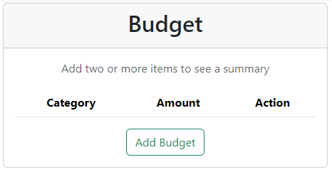

### 1.1.2. Budget view with two or more budget categories.

#### Input

- The app is opened in a browser.
- The app contains two budget categories.

#### Output

- The app is displayed.
- The app displays a card with the title "Budget".
- The card displays the total budget amount.
- The card displays a doughnut chart.
- The chart displays the budget categories with colors and their amounts.
- The card displays a list of budget categories with amounts, colors and a delete category option.
- The card has an "Add budget" button.

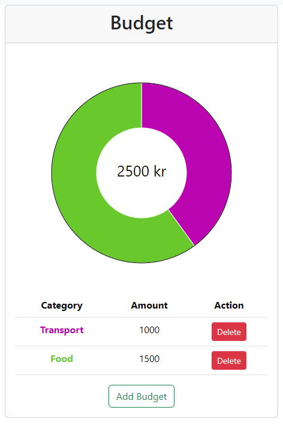

## 1.2. Add budget category.

### 1.2.1. Add budget category modal.

#### Input

- TC1.1.2.
- The "Add budget" button is clicked.

#### Output

- The app displays a modal with the title "Add budget".
- The modal has an input field for amount.
- The modal has an input field for category name.
- The modal has an "Add" button.
- The modal has a "Close" button.

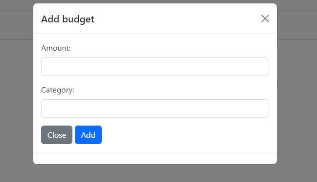

### 1.2.2. Add budget category modal close.

#### Input

- TC1.2.1.
- The "Close" button is clicked.

#### Output

- The modal is closed.

### 1.2.3. Add budget category modal invalid input.

#### Input

- TC1.2.1.
- The amount input field is empty.

#### Output

- The modal displays an error message.

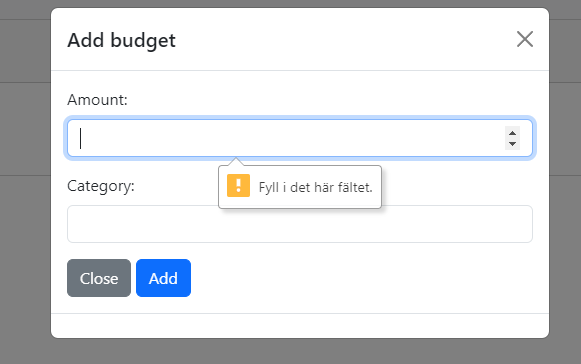

### 1.2.4. Add budget category modal valid input.

#### Input

- TC1.2.1.
- The amount input field is filled with a number, 1000.
- The category name input field is filled with a name, "Other".

#### Output

- The modal closes.
- The input fields are cleared.
- The input are displayed in the budget card.

### 1.2.5. Add new budget category.

#### Input

- TC1.2.4.

#### Output

- Budget card displays the new budget category.
- Budget card displays the new budget category amount.
- Budget card displays the new budget category color.
- Budget card displays the new total budget amount.
- Budget card displays the updated doughnut chart.

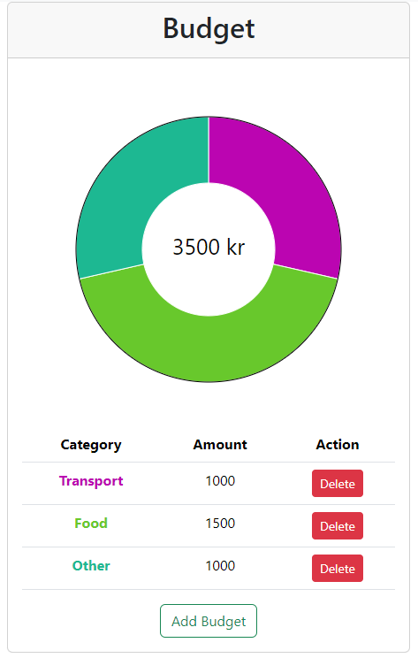

### 1.2.6. Add existing budget category amount.

#### Input

- TC1.2.4.
- The amount input field is filled with a number, 1000.
- The category name input field is filled with the name of an existing category, "Other".

#### Output

- Budget card displays the updated budget category amount.
- Budget card displays the updated total budget amount.
- Budget card displays the updated doughnut chart.

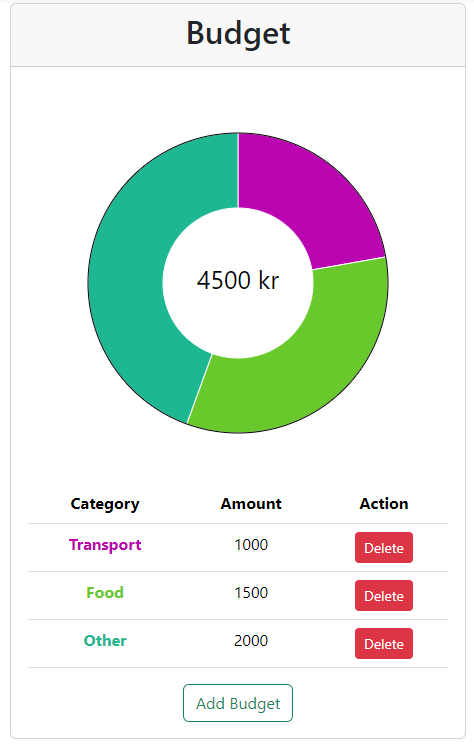

### 1.2.7. Add new budget category, that already exists as a expense category.

#### Input

- TC1.2.1.
- An expense category exists, "Houseing", with color rgb(184, 174, 54).
.png)
- The amount input field is filled with a number, 1000.
- The name input field is filled with a new category existent as expense category, "Housing".

#### Output

- Same as TC1.2.5. output.
- Budget card displays the new budget category color, rgb(184, 174, 54).

.png)

## 1.3. Remove budget category.

### 1.3.1. Remove budget category.

#### Input

- TC1.2.7.
- The delete button is clicked for Houseing category.

#### Output

- Budget card displays the updated budget category list.
- Budget card displays the updated total budget amount.
- Budget card displays the updated doughnut chart.

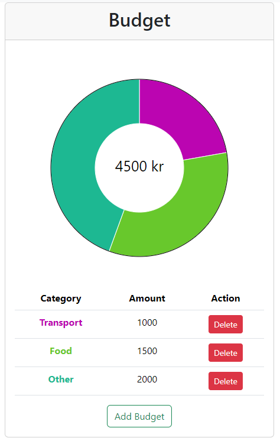

# 2. Expense.

## 2.1. Expense view.

### 2.1.1. Expense view with no expense categories.

#### Input

- The app is opened in a browser.
- The app contains no expense categories.

#### Output

- The app is displayed.
- The app displays a card with the title "Expense".
- The card prompts the user to add an expense category.
- The category list is empty.
- The card has an "Add expense" button.

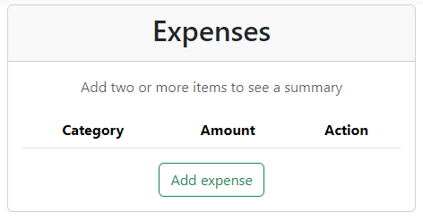

### 2.1.2. Expense view with two or more expense categories.

#### Input

- The app is opened in a browser.
- The app contains two expense categories.

#### Output

- The app is displayed.
- The app displays a card with the title "Expense".
- The card displays the total expense amount.
- The card displays a doughnut chart.
- The chart displays the expense categories with colors and their amounts.
- The card displays a list of expense categories with amounts, colors and a delete category option.
- The card has an "Add expense" button.

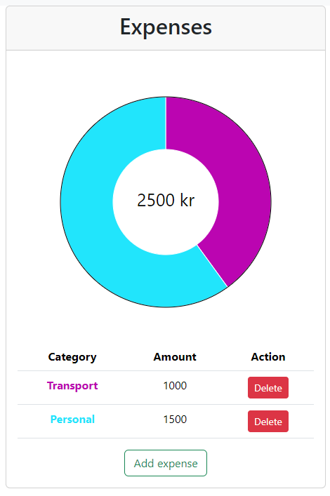

## 2.2. Add expense category.

### 2.2.1. Add expense category modal.

#### Input

- TC2.1.2.
- The "Add expense" button is clicked.

#### Output

- The app displays a modal with the title "Add expense".
- The modal has an input field for amount.
- The modal has an input field for category name.
- The modal has an "Add" button.
- The modal has a "Close" button.

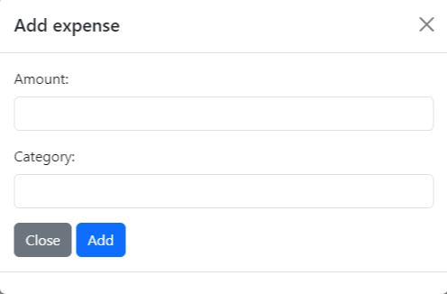

### 2.2.2. Add expense category modal close.

#### Input

- TC2.2.1.
- The "Close" button is clicked.

#### Output

- The modal is closed.

### 2.2.3. Add expense category modal invalid input.

#### Input

- TC2.2.1.
- The amount input field is empty.

#### Output

- The modal displays an error message.

### 2.2.4. Add expense category modal valid input.

#### Input

- TC2.2.1.
- The amount input field is filled with a number, 1000.
- The category name input field is filled with a name, "Other".

#### Output

- The modal closes.
- The input fields are cleared.
- The input is displayed in the expense card.

### 2.2.5. Add new expense category.

#### Input

- TC2.2.4.

#### Output

- Expense card displays the new expense category.
- Expense card displays the new expense category amount.
- Expense card displays the new expense category color.
- Expense card displays the new total expense amount.
- Expense card displays the updated doughnut chart.

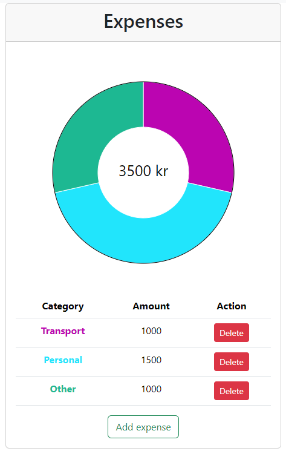

### 2.2.6. Add existing expense category amount.

#### Input

- TC2.2.4.
- The amount input field is filled with a number, 1000.
- The category name input field is filled with a name of a existing category, "Other".

#### Output

- Expense card displays the updated expense category amount.
- Expense card displays the updated total expense amount.
- Expense card displays the updated doughnut chart.

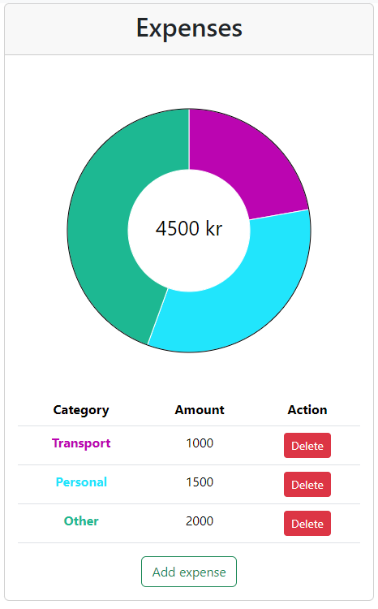

### 2.2.7. Add new expense category, that already exists as a budget category.

#### Input

- TC2.2.1.
- A budget category exists, "Houseing", with color rgb(108, 207, 112).

.png)
- The amount input field is filled with a number, 1000.
- The name input field is filled with a new category existent as budget category, "Housing".

#### Output

- Same as TC2.2.5. output.
- Expense card displays the new expense category color, rgb(108, 207, 112).

.png)

## 2.3. Remove expense category.

### 2.3.1. Remove expense category.

#### Input

- TC2.2.7.
- The delete button is clicked for Houseing category.

#### Output

- Expense card displays the updated expense category list.
- Expense card displays the updated total expense amount.
- Expense card displays the updated doughnut chart.

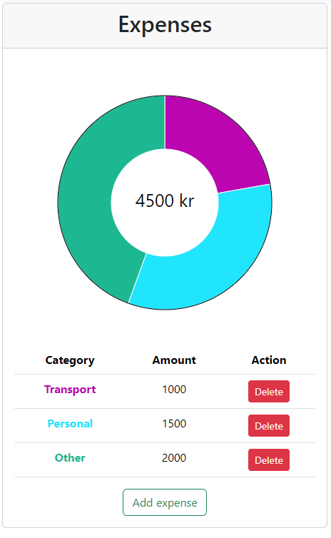

# 3. Balance.

## 3.1. Balance view.

### 3.1.1. Balance view with no budget or expense amounts.

#### Input

- The app is opened in a browser.
- The app contains no budget or expense amounts.

#### Output

- The app is displayed.
- The app displays a card with the title "Balance".
- The card displays the total balance amount, 0.

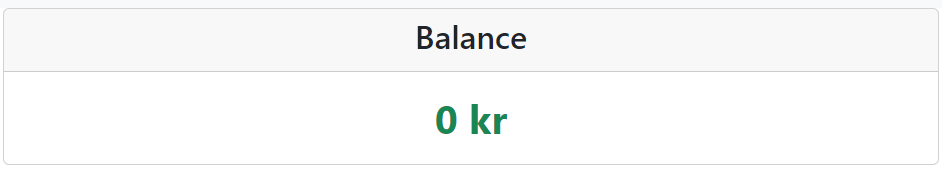

### 3.1.2. Balance view with budget and expense amounts.

#### Input

- The app is opened in a browser.
- The app contains two budget and expense amounts.

#### Output

- The app is displayed.
- The app displays a card with the title "Balance".
- The card displays the total balance amount.
- The card displays a pie chart.
- The chart displays the budget and expense amounts with colors.

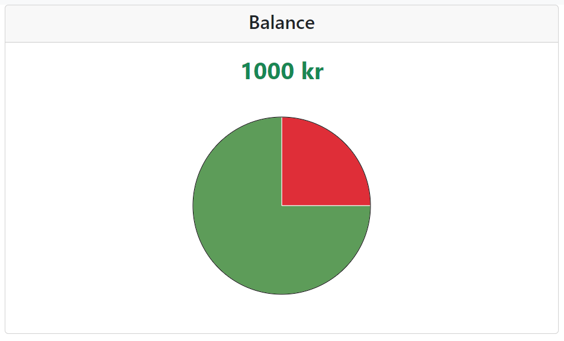

